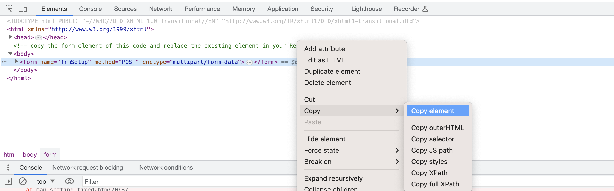

I could not find the feature working on any of the devices i bought. 
While on Firmware Version v28K.RPT.20160618 the fields in the WebUI are at least there, the restore button does cause an html issue.

man_setting.htm:23 Uncaught 
loadConfirm @ man_setting.htm:23
onclick @ man_setting.htm:83

As can be seen here, the loadConfirm function, which is supposed to check wheter a file is selected to upload and otherwise trigger a warning, does not reach an existing field, since they have two different names (line 23 defines the name "files", line 83 asks for "binary")

This obviously causes an error and besides the browser console, the HTTPD Server of the devices itself only logs "select error"

We can easily fix that, by just replacing "binary" two times in line 83.

For ease you can reproduce that, by pressing F12 to open your browsers dev settings. In the Elements Tab, press CMD+F to toggle the search bar, search for "binary", right click on the displayed line and edit as html. Now you can simply select the whole line and overwrite/paste the following fixed one:

<input type="file" class="input_man_text" id="files" name="files">

You should now be able to upload a before downloaded and or modified profile.bin
The filename can be anything, as long as its UTF-8 formated and the first line is #PROFILE

Firmware v28K.RPT.20180614 and obove (usually the ones on 8MB NOR) have the man_setting.htm site even more broken, so usually nothing works there at all. 

This is, because for some reason the part containing the save and upload button, <!--  is marked as comments and inactive	-->
Further the buttons are missing their respective names, as these buttons are no longer defined in the language file.
[Here](man_setting_fixed.htm) is  a completely fixed version of that page, so you can just drag that into your browser, head to the developer settings and in the elements tab, just copy the entire form element.

Now head back to the man_setting.htm tab opened on our repeater and replace that element. Right click it, edit as HTML, select all and paste to overwrite. 

All Save, Restore and Reset functionality should now be there (confirmed to work on the latest found firmware v28K.RPT.20220716)