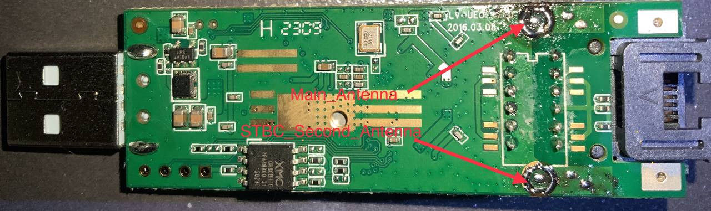
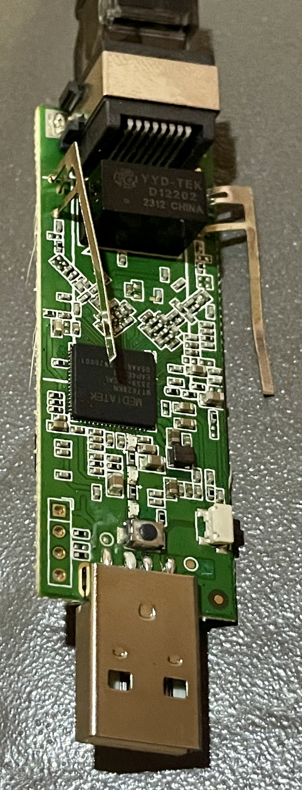
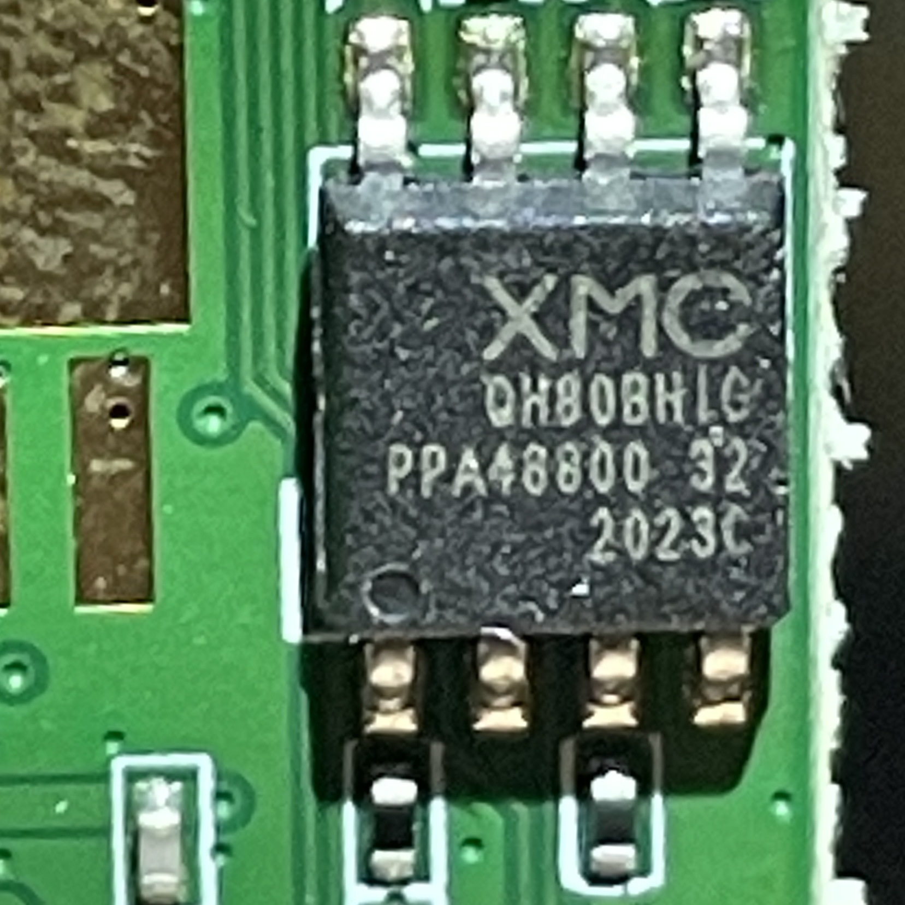
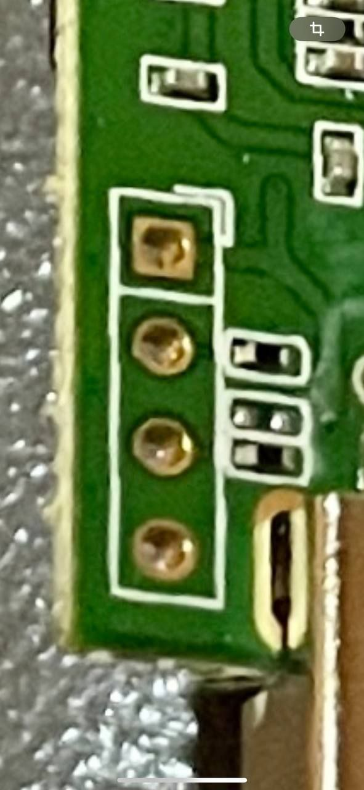
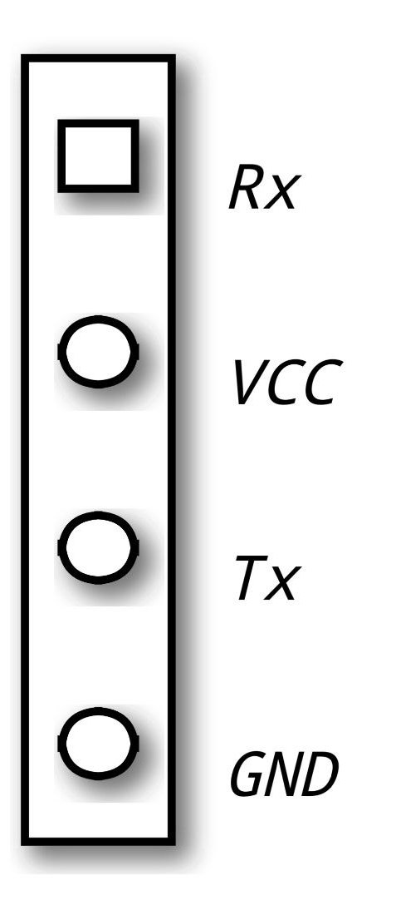

300M USB Ethernet TV Dongle

backside of the board. The steel (yes, steel) antennas can be desoldered from the upper side and the two points can be used to solder ipex connectors onto or coax-cables directly since we're keeping it cheap here.

These devices all seem to be using the same MT7628KN Chipset, however the choice of flash memory does vary (also in size). 

This one comes with the XMC XM25QH80BHIG SPI NOR Flash and a size of only 8MB, which probably further explains, why the firmware is so striped down on this paticular model. A Datasheet can be found [here](https://www.tongchip.com/wp-content/uploads/2020/01/8M-datesheet.pdf)
Other than that, there really ain't much, besides the mandatory Ethernet Impedance Matching Signal Transformer (YYD-TEK D12202) 

Its interesting to note that there is a TTL Serial Port Breakout on the board as shown here:

Routers using the same chipset often have the same breakout with the following pinout:

11520 Baud 8N1 mode 3.3V (Yet to be verified!!!)